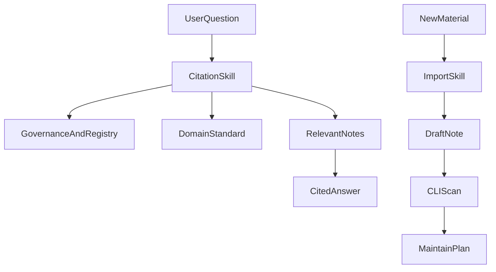

# Companion Skills

The CLI tools manage notes and maintenance reports. The companion skills tell an AI agent how to use the vault safely.

## Included Skills

### `kb-answer-with-citations`

Use this when asking the AI to answer from the knowledge base.

It requires the agent to:

- Read governance, routing rules, human-review registry, and domain standards.
- Prefer reviewed or registry-approved notes.
- Cite note paths for substantive claims.
- Separate source facts, inference, and uncertainty.
- Refuse to invent support when the vault does not contain enough evidence.

### `kb-import-and-maintain`

Use this when importing documents or maintaining the vault.

It requires the agent to:

- Save uncertain imports as low-trust drafts.
- Ask for human review when trust, placement, or future retrieval behavior changes.
- Run scan, improve, and maintain-plan flows safely.
- Avoid automatic note rewrites or trust upgrades.

### `kb-conversation-distiller`

Use this when the user explicitly asks to save or distill an agent conversation into the knowledge base.

It requires the agent to:

- Save a concise digest, not a full transcript.
- Extract reusable decisions, workflows, failure modes, anti-patterns, and follow-up actions.
- Save as `draft` with `evidence_level: user_experience`.
- Put digests in `00-global/conversation-digests/` by default.
- Run scan after writing.

## Install For Personal Use

```bash
mkdir -p ~/.cursor/skills
cp -R skills/kb-answer-with-citations ~/.cursor/skills/
cp -R skills/kb-import-and-maintain ~/.cursor/skills/
cp -R skills/kb-conversation-distiller ~/.cursor/skills/
```

## Install For A Project

```bash
mkdir -p .cursor/skills
cp -R skills/kb-answer-with-citations .cursor/skills/
cp -R skills/kb-import-and-maintain .cursor/skills/
cp -R skills/kb-conversation-distiller .cursor/skills/
```

Project skills can be committed with the project so every agent working in that repository sees the same instructions.

## Example Prompts

```text
基于我的知识库回答这个问题，并给出引用路径
```

This should trigger `kb-answer-with-citations`.

```text
把这个 Obsidian 文档导入知识库，按低信任草稿处理
```

This should trigger `kb-import-and-maintain`.

```text
把刚才这段对话沉淀到知识库
```

This should trigger `kb-conversation-distiller`.

## Why Skills Are Separate From CLI

The CLI checks files, produces reports, and records decisions. It does not control how an AI reads notes or cites evidence.

The skills cover the AI behavior layer:



## Vault Root Resolution

Skills should not contain machine-specific paths. Agents should resolve `vault_root` in this order:

1. User-provided `vault_root` in the current request.
2. `knowledge-vaults/` under the current workspace.
3. Environment variable `KNOWLEDGE_VAULT_ROOT`.
4. `00-global/state/vault-config.json` if already inside a vault.
5. Repository `starter/` only for examples or smoke tests.

If none is clear, the agent should ask for the vault path instead of guessing.
