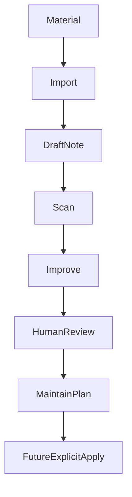

# Workflow

The toolkit separates raw material, human review, improvement suggestions, and apply previews.



## 1. Import

Imported material starts as a note with clear boundaries:

- What it can be used for.
- What it should not be used for.
- What evidence level it has.
- What still needs human review.

## 2. Scan

`scan` checks metadata, category fit, link health, trust risks, and governance fields.

```bash
python <vault_root>/00-global/scripts/kb.py --root <vault_root> scan
```

It is diagnostic only.

## 3. Improve

`improve` generates candidates such as frequently used drafts, stale high-risk notes, missing evidence, or conflict hints.

```bash
python <vault_root>/00-global/scripts/kb.py --root <vault_root> improve
```

Use `--write` only when you want report files.

## 4. Review Improvements

Humans decide what to do with each improvement candidate:

```bash
python <vault_root>/00-global/scripts/kb.py --root <vault_root> review-improvements --limit 5
python <vault_root>/00-global/scripts/kb.py --root <vault_root> review-improvements --decisions "1A 2B"
```

Decision meanings:

- `A`: accepted for review.
- `B`: needs more evidence.
- `C`: deferred.
- `D`: rejected.
- `E`: converted to task.

## 5. Maintain Plan

`maintain plan` turns reviewed improvement decisions into a preview:

```bash
python <vault_root>/00-global/scripts/kb.py --root <vault_root> maintain plan
```

The preview includes target path, target SHA256, proposed operations, evidence requirements, risk notes, rollback notes, and blocked or ready status.

## 6. Apply

In this version, apply is intentionally not implemented:

```bash
python <vault_root>/00-global/scripts/kb.py --root <vault_root> maintain apply --plan-id <plan-id>
```

It reports `not_implemented` and does not modify notes. This keeps the current release useful for planning while preventing accidental knowledge mutation.
