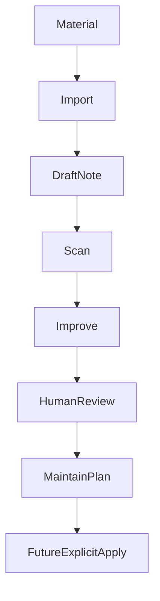

# Workflow

The toolkit separates raw material, human review, improvement suggestions, and apply previews.



## 1. Import

Imported material starts as a note with clear boundaries:

- What it can be used for.
- What it should not be used for.
- What evidence level it has.
- What still needs human review.

## 2. Scan

`scan` checks metadata, category fit, link health, trust risks, and governance fields.

```bash
python <vault_root>/00-global/scripts/kb.py --root <vault_root> scan
```

It is diagnostic only.

## 3. Improve

`improve` generates candidates such as frequently used drafts, stale high-risk notes, missing evidence, or conflict hints.

```bash
python <vault_root>/00-global/scripts/kb.py --root <vault_root> improve
```

Use `--write` only when you want report files.

## 4. Review Improvements

Humans decide what to do with each improvement candidate:

```bash
python <vault_root>/00-global/scripts/kb.py --root <vault_root> review-improvements --limit 5
python <vault_root>/00-global/scripts/kb.py --root <vault_root> review-improvements --decisions "1A 2B"
```

Decision meanings:

- `A`: accepted for review.
- `B`: needs more evidence.
- `C`: deferred.
- `D`: rejected.
- `E`: converted to task.

## 5. Maintain Plan

`maintain plan` turns reviewed improvement decisions into a preview:

```bash
python <vault_root>/00-global/scripts/kb.py --root <vault_root> maintain plan
```

The preview includes target path, target SHA256, proposed operations, evidence requirements, risk notes, rollback notes, and blocked or ready status.

## 6. Apply

```bash
python <vault_root>/00-global/scripts/kb.py --root <vault_root> maintain apply --plan-id <plan-id>
```

The default apply command is a dry-run. It checks plan availability, target status, and target SHA256 without writing.

To write, the user must explicitly confirm the exact plan id:

```bash
python <vault_root>/00-global/scripts/kb.py --root <vault_root> maintain apply --plan-id <plan-id> --write --confirm <plan-id>
```

The apply workflow:

1. Loads `00-global/state/maintenance-apply-plans.jsonl`.
2. Finds the matching plan.
3. Requires `status: ready_preview`.
4. Verifies the target file is still inside the vault.
5. Recomputes target SHA256 and compares it to the plan.
6. Saves a rollback snapshot under `00-global/state/rollback/`.
7. Applies only safe structured operations.

Supported operations are intentionally narrow: metadata patch, append maintenance review note, and split draft scaffold.

## 7. Trust Drift

Generate a trust drift report when registry decisions and note metadata may have diverged:

```bash
python <vault_root>/00-global/scripts/trust-drift-report.py --root <vault_root>
python <vault_root>/00-global/scripts/trust-drift-report.py --root <vault_root> --write
```

The report detects frontmatter/registry mismatches, missing registry targets, and `verified` notes without strong evidence or evidence checklist fields. It does not modify notes.
